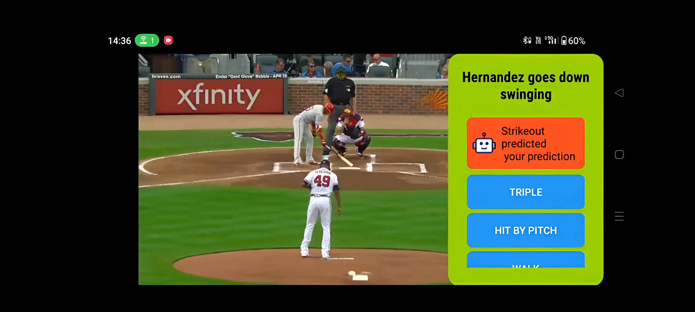

# SwingStream

## Description
A streaming app for baseball fans along with some extra Ai features(see images)



## Features
- Multiple languages
- AI-Fan interaction about next event
- Content-based filtering and telecasting Homerun videos

## Installation
```sh
# Clone the repository
git clone https://github.com/alien-cyber/SwingStream.git

# Navigate to the project directory
cd backend

# Install dependencies
npm install  # or pip install -r requirements.txt
```

## Usage
```sh
# Run the project
npm start  # or python main.py
```

## Contributing
1. Fork the repository
2. Create a new branch (`git checkout -b feature-branch`)
3. Commit your changes (`git commit -m 'Add new feature'`)
4. Push to the branch (`git push origin feature-branch`)
5. Create a Pull Request

## License
This project is licensed under the MIT License - see the [LICENSE](LICENSE) file for details.

## Contact
For any issues or suggestions, contact [your-email@example.com](mailto:your-email@example.com).
